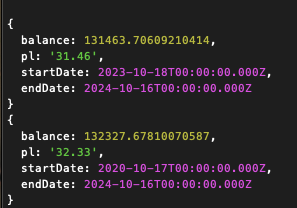

# greed-and-fear
 Uses [alternative.me](https://alternative.me/crypto/fear-and-greed-index/) fear & greed index to trade BTC.

 This is a simple node application when run will each day at midnight check for new fear & greed index classification to determine if one should buy, sell or hold BTC. This is for educational purposes only and as of now buy/sell methods have a hardcoded buy/sell amount of btc.

 ## Usage
 Clone this repo

 ``` bash
git clone 

cd greed-and-fear

nvm use

npm i

npm start
```

To run backtest use 

``` bash
npm test
```

